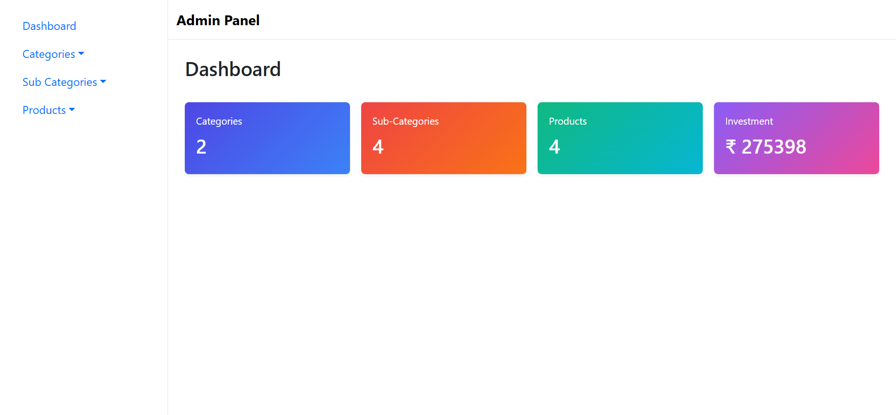
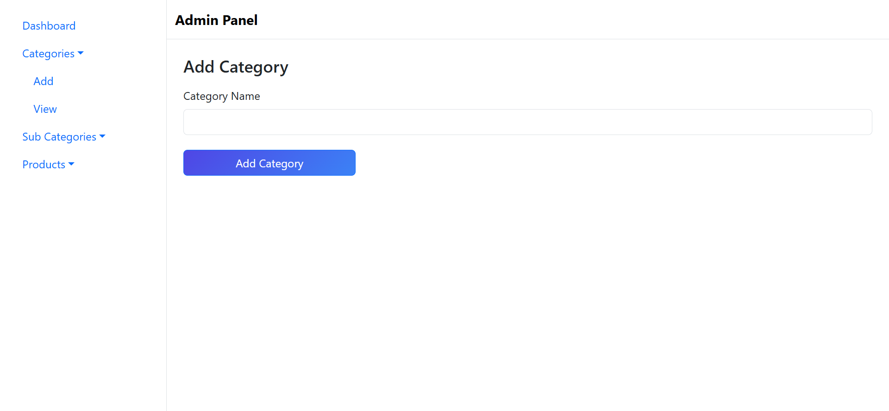
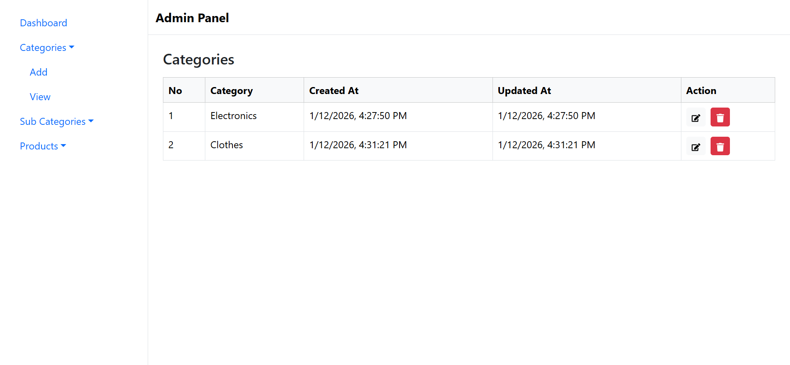
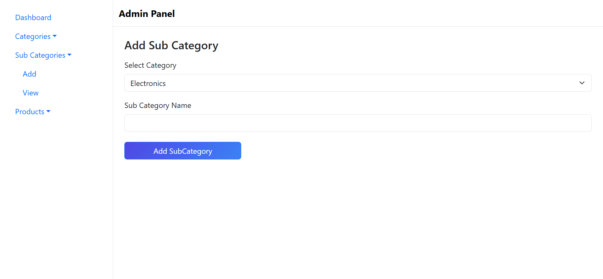
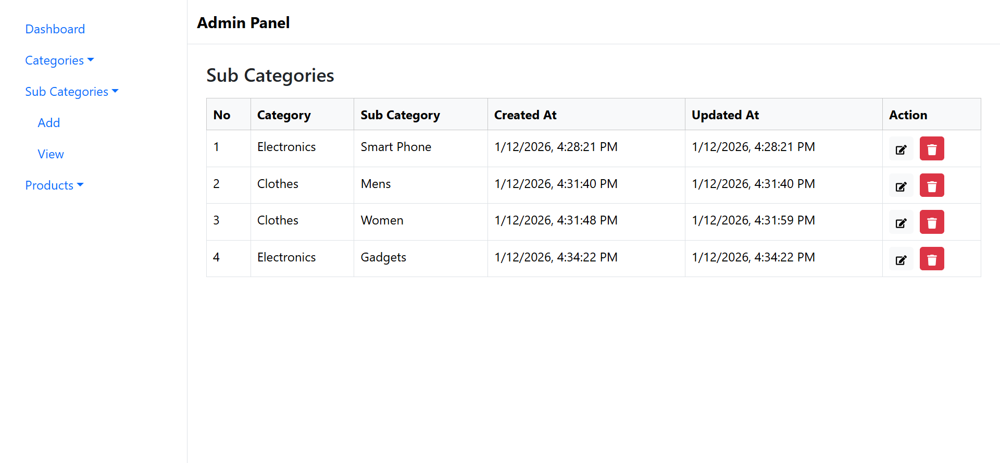
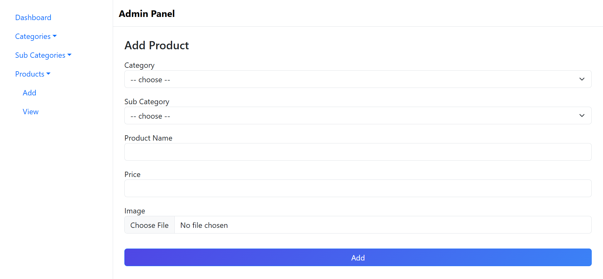
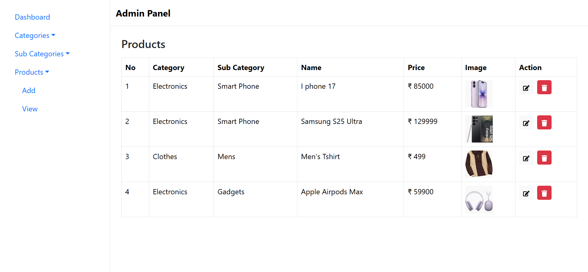

# 🛒 MERN Admin Dashboard – Admin Panel

This project is a **full-stack Admin Dashboard application** built using the **MERN Stack** (MongoDB, Express.js, React, Node.js).  
It allows admins to **manage categories, subcategories, and products**, including **product image upload, update, and removal**, along with a **dashboard that displays overall statistics**.

The backend uses **MongoDB populate** to maintain relationships between Category, Subcategory, and Product.  
The frontend is developed using **React with Redux Toolkit and Redux Thunk** for efficient state management and API handling.

The UI follows a **clean, admin-friendly layout**, making it suitable for real-world admin panels as well as portfolio showcase.

---

## 🚀 Features  

* 📁 **Category Management**
  * Add new categories  
  * View category list  
  * Update and remove categories  

* 📂 **Subcategory Management**
  * Add subcategories under categories  
  * Category name fetched using **MongoDB populate**  
  * View subcategories with category reference  
  * Update and remove subcategories  

* 📦 **Product Management**
  * Add products with category & subcategory  
  * Upload product image from frontend  
  * Update product details and image  
  * Remove products  

* 🖼️ **Product Image Upload**
  * Image upload using Multer  
  * Existing image preview while updating  
  * Image replace support  

* 📊 **Admin Dashboard**
  * Total number of categories  
  * Total number of subcategories  
  * Total number of products  
  * Total sum of all product prices  

* ⚡ **Full MERN Stack Integration**
  * React frontend with Redux Thunk  
  * Node.js & Express backend  
  * MongoDB with populated relations  

---

## 🛠️ Tech Stack  

    
  <b>React</b> — Frontend library for building UI  
    

    
  <b>Redux Toolkit & Redux Thunk</b> — State management and async API handling  
    

    
  <b>Node.js</b> — Backend runtime environment  
    

    
  <b>Express.js</b> — Backend framework for APIs  
    

    
  <b>MongoDB</b> — Database with populate relations  
    

    
  <b>CSS / Bootstrap</b> — Styling and responsive UI  

---

## 📸 Project Preview  

### 📊 Dashboard  

### ➕ Add Category  

### 📁 View Category  

### ➕ Add Subcategory  

### 📂 View Subcategory  

### ➕ Add Product  

### 📦 View Product  

---

## ⚙️ How It Works  

1. Admin accesses the dashboard after starting the application.  
2. Categories are created first, followed by subcategories linked to categories.  
3. Products are added using category and subcategory references.  
4. Backend uses **MongoDB populate** to fetch related category and subcategory data.  
5. Product images are uploaded from frontend and stored on the server.  
6. Dashboard dynamically displays counts and total product price.  

---

## 🌟 Highlights  

* MongoDB **populate usage for relational data**  
* Product image upload, update, and preview  
* Redux Toolkit with Thunk for clean state management  
* Separate frontend and backend architecture  
* Real-world **Admin Dashboard project**   

---

## 👨‍💻 Author  

Developed by **Nirav Thakor**  
MERN Stack Developer  
